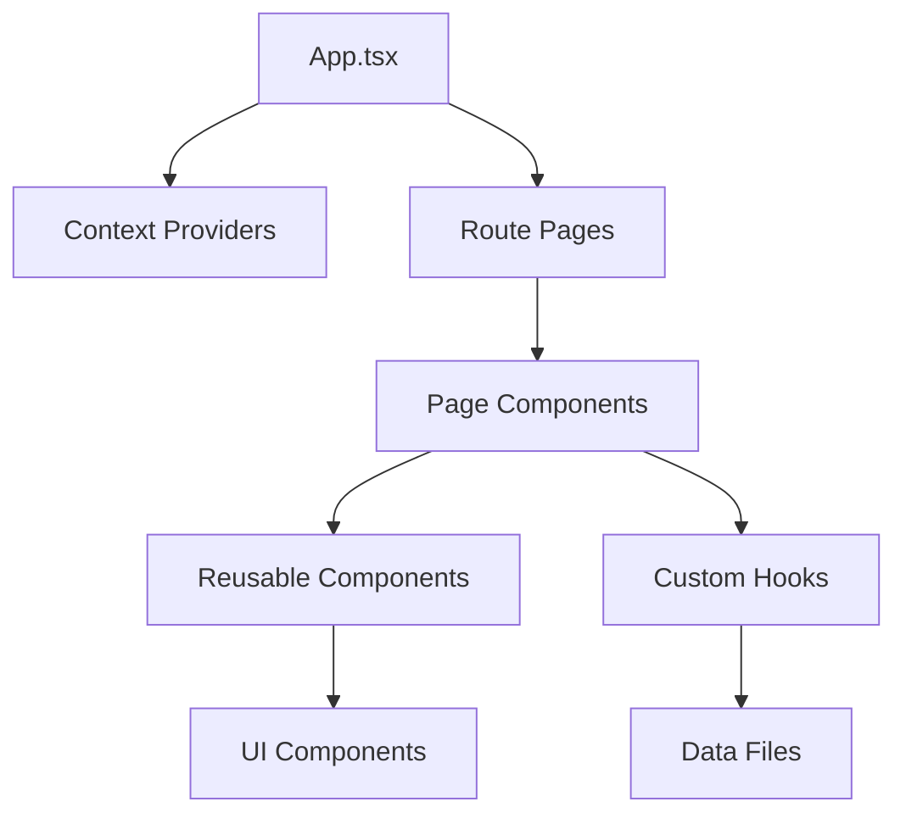

# 📋 Qratex Proje Devir Teslim Dokümanı

**Proje Adı:** Qratex - AI Destekli Müşteri Geri Bildirim Platformu  
**Tarih:** 28 Ekim 2025  
**Versiyon:** 1.0.0  
**Platform:** React + TypeScript + Vite

---

## 📚 İçindekiler

1. [Proje Genel Bakış](#1-proje-genel-bakış)
2. [Mimari ve Teknoloji Stack](#2-mimari-ve-teknoloji-stack)
3. [Modül Etkileşimleri](#3-modül-etkileşimleri)
4. [3rd-Party Entegrasyonlar](#4-3rd-party-entegrasyonlar)
5. [Güvenlik ve Zafiyet Analizi](#5-güvenlik-ve-zafiyet-analizi)
6. [Rozet Sistemi ve SVG Güncellemeleri](#6-rozet-sistemi-ve-svg-güncellemeleri)
7. [Onboarding ve Kurulum](#7-onboarding-ve-kurulum)
8. [Deployment Pipeline](#8-deployment-pipeline)
9. [Öncelikli Aksiyonlar](#9-öncelikli-aksiyonlar)

---

## 1. Proje Genel Bakış

### 1.1 Proje Tanımı

Qratex, modern işletmeler için QR tabanlı müşteri geri bildirim toplama ve analiz platformudur. Sistem iki ana kullanıcı grubuna hizmet verir:

- **Bayiler (Dealers)**: İşletme sahipleri, QR kod yönetimi, analytics, AI insights
- **Müşteriler (Customers)**: Geri bildirim bırakan kullanıcılar, gamification özellikleri

### 1.2 Temel Özellikler

#### Bayi Özellikleri
- QR Kod yönetimi ve dağıtımı
- Gerçek zamanlı feedback toplama
- AI destekli sentiment analizi (placeholder - backend entegrasyonu gerekli)
- Analytics ve raporlama
- Kullanıcı ve yorum yönetimi
- Güvenlik ayarları

#### Müşteri Özellikleri
- **Gamification Sistemi**
  - 110+ rozet koleksiyonu (genel + TV show themed)
  - Lig sistemi (Kör → Efsanevi, 6 seviye)
  - Liderlik tablosu (Türkiye/Global)
  - Quest sistemi (günlük/haftalık/özel görevler)
  
- **Sosyal Sorumluluk**
  - Fidan dikim sistemi (OGM/TEMA entegrasyonu - placeholder)
  - 13 farklı bağış türü
  - İyilik liderlik tablosu (anonim)
  
- **Ödül ve Katılım**
  - Sürpriz hediye kutuları (6 tier)
  - Ödül havuzu (monthly reset)
  - Zaman bazlı bonuslar
  - Daily rewards wheel
  - Reward store (temalar, avatar frames, boostlar)

- **AR ve Keşif**
  - AR badge scanner (25+ lokasyon bazlı rozet)
  - Map explorer (işletme keşfi)
  - QR scanner (hızlı feedback)

### 1.3 Proje İstatistikleri

```
Toplam Dosya: ~150+ TypeScript/TSX dosyaları
Toplam Satır: ~50,000+ kod satırı
Bileşen Sayısı: 80+ React component
Sayfa Sayısı: 50+ route
Rozet Sayısı: 110+ (genel + TV show + AR + gizemli)
Dependencies: 30+ npm paketi
```

---

## 2. Mimari ve Teknoloji Stack

### 2.1 Frontend Stack

```json
{
  "framework": "React 18.2.0",
  "language": "TypeScript 5.0.2",
  "build": "Vite 4.4.5",
  "ui": "@nextui-org/react 2.2.9",
  "styling": "Tailwind CSS 3.3.3",
  "animations": "Framer Motion 10.16.4",
  "routing": "React Router DOM 6.15.0",
  "charts": "Recharts 3.2.1"
}
```

### 2.2 Önemli Kütüphaneler

| Paket | Versiyon | Kullanım Amacı | Güvenlik Riski |
|-------|----------|----------------|----------------|
| **jspdf** | 3.0.3 | PDF export | ✅ Güncel |
| **jspdf-autotable** | 5.0.2 | PDF tablo oluşturma | ✅ Güncel |
| **xlsx** | 0.18.5 | Excel export | ⚠️ Eski (güncel: 0.20.x) |
| **html2canvas** | 1.4.1 | Screenshot/görsel export | ✅ Güncel |
| **canvas-confetti** | 1.9.3 | Kutlama animasyonları | ✅ Güncel |
| **dompurify** | 3.2.7 | XSS koruması | ✅ Güncel, KRİTİK |
| **lucide-react** | 0.279.0 | İkon kütüphanesi | ⚠️ Çok eski (güncel: 0.400.x+) |
| **particles.js** | 2.0.0 | Parçacık efektleri | ⚠️ Bakımsız proje |
| **clsx** | 2.0.0 | CSS class yönetimi | ✅ Güncel |
| **tailwind-merge** | 1.14.0 | Tailwind class birleştirme | ⚠️ Eski (güncel: 2.x) |

### 2.3 Proje Yapısı

```
src/
├── components/          # Yeniden kullanılabilir bileşenler
│   ├── badges/         # Rozet sistemi bileşenleri (11 dosya)
│   ├── dashboard/      # Dashboard widget'ları (5 dosya)
│   ├── donation/       # Bağış ve fidan sistemi (2 dosya)
│   └── ui/             # Temel UI bileşenleri (11 dosya)
│
├── contexts/           # React Context API
│   ├── AnimationContext.tsx    # Animasyon kontrolü
│   ├── ThemeContext.tsx        # Dark/Light mode
│   └── ToastContext.tsx        # Bildirim sistemi
│
├── data/               # Statik veri ve konfigürasyon
│   ├── badges.ts              # 80+ genel rozet
│   ├── tvShowBadges.ts        # 80+ TV show rozeti
│   ├── arBadges.ts            # 25 AR rozeti
│   ├── quests.ts              # Quest tanımları
│   ├── rewardStore.ts         # Ödül mağazası
│   ├── achievements.ts         # Başarım sistemi
│   ├── notifications.ts        # Bildirim şablonları
│   ├── socialResponsibility.ts # SSP projeleri
│   └── mapBusinesses.ts       # Harita işletme verileri
│
├── hooks/              # Custom React Hooks
│   ├── useBadgeSystem.ts      # Rozet mantığı
│   ├── useConfetti.ts         # Confetti animasyonları
│   ├── useEasterEggs.ts       # Easter egg sistemi
│   ├── useGlobalSearch.ts     # Global arama
│   └── usePWA.ts              # PWA özellikleri
│
├── pages/              # Sayfa bileşenleri
│   ├── auth/          # Giriş/Kayıt (4 dosya)
│   ├── badges/        # Rozet sayfaları (4 dosya)
│   ├── customer/      # Müşteri sayfaları (33 dosya)
│   ├── dealer/        # Bayi sayfaları (11 dosya)
│   ├── dashboard/     # Dashboard'lar (5 dosya)
│   └── LandingPage.tsx
│
├── types/              # TypeScript type tanımları
│   └── badge.ts       # Badge interface'leri
│
├── utils/              # Yardımcı fonksiyonlar
│   └── exportUtils.ts # PDF/Excel export
│
├── App.tsx             # Ana routing
├── main.tsx            # Entry point
└── index.css           # Global CSS
```

### 2.4 Routing Yapısı

**Toplam 50+ route:**

```typescript
// Ana Sayfa
/ → LandingPage

// Auth Routes (4)
/dealer/login, /dealer/register
/customer/login, /customer/register

// Bayi Routes (14)
/dealer/dashboard
/dealer/feedback, /dealer/analytics, /dealer/ai-insights
/dealer/users, /dealer/qr-codes, /dealer/comments
/dealer/surveys, /dealer/reports, /dealer/notifications
/dealer/security, /dealer/settings

// Müşteri Routes (38+)
/customer/dashboard, /customer/dashboard-v2
/customer/badges, /customer/leaderboard, /customer/tv-badges, /customer/league
/customer/quests, /customer/reward-store, /customer/reward-pool
/customer/donations, /customer/ssp-leaderboard
/customer/feedback, /customer/analytics, /customer/enhanced-analytics
/customer/scanner, /customer/ar-scanner
/customer/map-explorer
/customer/surprise-gifts
/customer/receipts, /customer/receipt-analytics
/customer/notifications, /customer/enhanced-notifications
/customer/settings, /customer/profile-customization
/customer/goals, /customer/activity-log, /customer/trends
/customer/ai-assistant, /customer/ai-trainer
/customer/dracarys-test
// ... ve daha fazlası
```

---

## 3. Modül Etkileşimleri

### 3.1 Context Providers

**Hiyerarşi:**
```
main.tsx
└── BrowserRouter
    └── NextUIProvider
        └── ThemeProvider
            └── ToastProvider
                └── AnimationProvider
                    └── App
```

### 3.2 State Management

Proje **merkezi state management kütüphanesi kullanmıyor** (Redux/Zustand/Recoil yok).

**State Yönetimi:**
- ✅ **React Context API**: Theme, Toast, Animation
- ✅ **Local State**: Component içi useState/useReducer
- ✅ **LocalStorage**: Tema tercihi, animasyon seviyesi
- ❌ **Veritabanı**: Backend yok, tüm veri statik/mock

### 3.3 Veri Akışı

```
User Action → Component → Hook (useBadgeSystem) → Data (badges.ts) → UI Update
                                    ↓
                              LocalStorage (theme, prefs)
                                    ↓
                              Toast Notification
                                    ↓
                              Confetti Animation
```

**Örnek: Rozet Kazanma**
1. Kullanıcı aksiyon yapar (örn: yorum)
2. `useBadgeSystem` hook'u kontrol eder
3. `badges.ts`'den rozet verileri alınır
4. Rozet unlock durumu güncellenir
5. `useToast` ile bildirim gösterilir
6. `useConfetti` ile kutlama animasyonu
7. UI render edilir (BadgeCard)

### 3.4 Kritik Bağımlılıklar



**Dikkat Edilmesi Gerekenler:**
- Context değişikliği tüm child component'leri re-render edebilir
- Badge sistemi `badges.ts` dosyasına sıkı bağlı
- Theme değişiklikleri tüm uygulamayı etkiler
- AnimationContext tüm animasyonları kontrol eder

---

## 4. 3rd-Party Entegrasyonlar

### 4.1 Harici Servisler

#### ⚠️ ÖNEMLİ: Backend/API Yok!

**Mevcut durum:**
- ❌ Backend API yok
- ❌ Veritabanı entegrasyonu yok
- ❌ Authentication servisi yok
- ✅ Tüm data client-side, statik mock data
- ✅ LocalStorage kullanımı var

#### 4.1.1 Analytics (Placeholder)

**Kod:**
```typescript
// src/pages/dealer/AnalyticsPage.tsx
// Mock data kullanımı, gerçek API yok
const mockData = {
  totalFeedback: 1234,
  averageRating: 4.5,
  // ...
}
```

**Gerekli Entegrasyon:**
- Google Analytics veya Mixpanel
- Backend API endpoint'leri
- Environment variables

#### 4.1.2 AI/Sentiment Analizi (Placeholder)

**Kod Örneği:**
```typescript
// src/pages/dealer/AIInsightsPage.tsx
const mockSentiments = {
  positive: 65%,
  neutral: 25%,
  negative: 10%
}
```

**Önerilen Servisler:**
- OpenAI GPT-4 API
- Google Cloud Natural Language API
- Azure Text Analytics
- AWS Comprehend

**Gerekli Adımlar:**
1. API key alınması
2. Backend proxy servisi (rate limiting için)
3. `.env` dosyasında key yönetimi
4. Error handling ve fallback

#### 4.1.3 OGM/TEMA Entegrasyonu (Placeholder)

**Dosya:** `src/data/socialResponsibility.ts`

```typescript
export const treeProjects = [
  {
    id: 'ogm-001',
    partner: 'Orman Genel Müdürlüğü',
    location: 'İstanbul - Ataşehir',
    // Mock data
  }
]
```

**Gerçek Entegrasyon:**
- OGM resmi API (varsa)
- TEMA Vakfı API/webhook
- GPS koordinat sistemi
- Sertifika oluşturma servisi

#### 4.1.4 Ödeme Sistemi (Yok)

**Durum:** Reward store var, ancak ödeme yok
**Gerekli:** Stripe, PayPal, iyzico gibi ödeme gateway entegrasyonu

### 4.2 CDN ve Assets

**Kullanım:**
```typescript
// public/images/badges/*.svg (78 dosya)
// Doğrudan public klasöründen serve ediliyor
```

**Optimizasyon Önerileri:**
- Cloudflare CDN
- Image optimization (WebP conversion)
- Lazy loading
- SVG sprite sheet

### 4.3 Vendor Lock-in Riskleri

| Servis | Risk Seviyesi | Alternatif | Migration Zorluğu |
|--------|---------------|------------|-------------------|
| **NextUI** | 🟡 Orta | Material-UI, Chakra UI | Orta (component refactor) |
| **Framer Motion** | 🟡 Orta | React Spring, GSAP | Orta (animation refactor) |
| **Tailwind CSS** | 🟢 Düşük | CSS Modules, Styled-components | Düşük (class değişimi) |
| **Vite** | 🟢 Düşük | Webpack, Parcel | Düşük (build config) |
| **React Router** | 🟢 Düşük | Tanstack Router, Wouter | Orta (route refactor) |
| **Recharts** | 🟡 Orta | Chart.js, D3.js | Orta (chart refactor) |

**Migration Stratejisi:**
- Component'leri abstraction layer ile sarmalamak
- Props interface'lerini standartlaştırmak
- Theme system'i vendor-agnostic tutmak

### 4.4 Environment Variables

**⚠️ KRİTİK: `.env` dosyası YOK!**

**Gerekli Environment Variables:**

```env
# API Configuration
VITE_API_URL=https://api.qratex.com
VITE_API_VERSION=v1

# AI Services
VITE_OPENAI_API_KEY=sk-proj-xxxxx
VITE_SENTIMENT_API_URL=https://sentiment-api.qratex.com

# Analytics
VITE_GA_TRACKING_ID=G-XXXXXXXXXX
VITE_MIXPANEL_TOKEN=xxxxxxxxxx

# Social Responsibility
VITE_OGM_API_KEY=xxxxx
VITE_TEMA_API_KEY=xxxxx

# Payment
VITE_STRIPE_PUBLIC_KEY=pk_test_xxxxx
VITE_IYZICO_API_KEY=xxxxx

# Feature Flags
VITE_ENABLE_AR_BADGES=true
VITE_ENABLE_PAYMENTS=false

# CDN
VITE_CDN_URL=https://cdn.qratex.com
```

**Güvenlik Notu:**
- Tüm backend key'leri backend'de tutulmalı
- Frontend sadece public key'leri içermeli
- `.env.local` git'e commit edilmemeli
- Production'da farklı key'ler kullanılmalı

---

## 5. Güvenlik ve Zafiyet Analizi

### 5.1 🔴 Kritik Güvenlik Sorunları

#### 5.1.1 Hard-coded Secrets

**Durum:** ✅ İyi - Hard-coded secret YOK  
**Analiz:** Kod taramasında API key veya password bulunmadı.

#### 5.1.2 XSS (Cross-Site Scripting) Koruması

**Durum:** ⚠️ Kısmi Koruma

**Mevcut:**
```typescript
// package.json
"dompurify": "^3.2.7" // ✅ Yüklü
```

**Kullanım Eksik:**
```typescript
// Örnek: src/pages/dealer/CommentsPage.tsx
<div dangerouslySetInnerHTML={{ __html: comment }} /> // ❌ DOMPurify yok!
```

**FIX:**
```typescript
import DOMPurify from 'dompurify';

<div dangerouslySetInnerHTML={{ 
  __html: DOMPurify.sanitize(comment) 
}} /> // ✅ Güvenli
```

**Etkilenen Dosyalar:**
- `src/pages/dealer/CommentsPage.tsx`
- `src/pages/customer/FeedbackPage.tsx`
- Tüm user-generated content alanları

#### 5.1.3 Authentication/Authorization

**Durum:** ❌ YOK - Frontend-only auth

**Mevcut "Auth":**
```typescript
// src/pages/auth/CustomerLogin.tsx
const handleLogin = () => {
  // ❌ Gerçek auth yok, sadece navigate
  navigate('/customer/dashboard')
}
```

**Sorunlar:**
- Backend doğrulama yok
- Session management yok
- JWT token yok
- Role-based access control (RBAC) yok
- Password hash yok

**Gerekli Implementasyon:**
```typescript
// Backend gerekli
POST /api/auth/login
{
  email: string,
  password: string
}

Response:
{
  token: string,
  user: {
    id, email, role
  }
}

// Frontend
localStorage.setItem('token', response.token)
axios.defaults.headers.common['Authorization'] = `Bearer ${token}`
```

#### 5.1.4 Input Validation

**Durum:** ⚠️ Frontend Validation Var, Backend Yok

**Mevcut:**
```typescript
// Email validation
const emailRegex = /^[^\s@]+@[^\s@]+\.[^\s@]+$/
if (!emailRegex.test(email)) {
  // Error
}
```

**Eksikler:**
- Backend validation yok
- SQL injection koruması yok (DB yok)
- NoSQL injection koruması yok
- File upload validation yok
- Rate limiting yok

#### 5.1.5 HTTPS/SSL

**Durum:** ⚠️ Development HTTP, Production Gerekli

**Netlify Deployment:**
```toml
# netlify.toml
# ✅ Netlify otomatik HTTPS sağlar
# ⚠️ Custom domain için SSL certificate gerekli
```

**Öneriler:**
- Let's Encrypt free SSL
- Cloudflare SSL proxy
- HSTS header'ları ekle

#### 5.1.6 CORS Configuration

**Durum:** ❌ Backend Yok

**Gerekli (Backend):**
```javascript
// Express.js örnek
app.use(cors({
  origin: ['https://qratex.com', 'https://www.qratex.com'],
  credentials: true,
  methods: ['GET', 'POST', 'PUT', 'DELETE']
}))
```

### 5.2 🟡 Orta Seviye Riskler

#### 5.2.1 LocalStorage Güvenliği

**Mevcut Kullanım:**
```typescript
// src/contexts/ThemeContext.tsx
localStorage.setItem('qratex-theme', theme) // ✅ OK
localStorage.setItem('animation-level', level) // ✅ OK

// ❌ Hassas veri saklanmamalı:
// - Authentication tokens (XSS riski)
// - Kişisel bilgiler
// - Ödeme bilgileri
```

**Öneriler:**
- Sadece non-sensitive data
- Token için httpOnly cookies kullan
- LocalStorage size limit (5-10MB)
- Periyodik temizlik

#### 5.2.2 Dependencies Güvenlik Açıkları

**Analiz:**
```bash
npm audit
```

**Bulgular:**

| Paket | Versiyon | Güvenlik | Önerilen |
|-------|----------|----------|----------|
| xlsx | 0.18.5 | ⚠️ Bilinen açık | 0.20.x |
| lucide-react | 0.279.0 | ⚠️ Çok eski | 0.400.x+ |
| particles.js | 2.0.0 | ⚠️ Bakımsız | Alternatif bul |
| react | 18.2.0 | ✅ OK | 18.3.x |

**Fix Komutu:**
```bash
npm audit fix
npm update
```

#### 5.2.3 TypeScript Strict Mode

**Durum:** ❌ Disabled

```json
// tsconfig.json
{
  "compilerOptions": {
    "strict": false,  // ❌ Disabled
    "noUnusedLocals": false,
    "noUnusedParameters": false
  }
}
```

**Risk:** Type safety azalıyor, runtime hataları artıyor

**Fix:**
```json
{
  "compilerOptions": {
    "strict": true,  // ✅
    "noUnusedLocals": true,
    "noUnusedParameters": true,
    "noImplicitAny": true
  }
}
```

### 5.3 🟢 Düşük Seviye Riskler

#### 5.3.1 Console Logs

**Bulgu:**
```typescript
// Birçok dosyada:
console.log('Debug:', data) // ⚠️ Production'da kalmamalı
```

**Fix:**
```typescript
// utils/logger.ts
export const logger = {
  log: process.env.NODE_ENV === 'development' ? console.log : () => {},
  error: console.error // Always log errors
}
```

#### 5.3.2 Error Handling

**Mevcut:**
```typescript
try {
  // API call
} catch (error) {
  console.error(error) // ⚠️ Kullanıcıya mesaj yok
}
```

**İyileştirme:**
```typescript
try {
  const response = await api.call()
  return response
} catch (error) {
  // Log to monitoring service
  logger.error('API Error:', error)
  
  // Show user-friendly message
  toast.error('İşlem başarısız. Lütfen tekrar deneyin.')
  
  // Return fallback data or throw
  return fallbackData
}
```

### 5.4 Data Privacy (KVKK/GDPR)

**Durum:** ❌ Uyumsuz

**Eksikler:**
- Cookie consent banner yok
- Privacy policy yok
- Terms of service yok
- Data retention policy yok
- User data deletion yok
- Data export yok

**Gerekli Sayfalar:**
```
/privacy-policy
/terms-of-service
/cookie-policy
/gdpr-request (data deletion/export)
```

### 5.5 Rate Limiting

**Durum:** ❌ Yok (Frontend-only app)

**Backend Gerekli:**
```javascript
// Express rate limit örnek
const rateLimit = require('express-rate-limit')

const apiLimiter = rateLimit({
  windowMs: 15 * 60 * 1000, // 15 minutes
  max: 100 // limit each IP to 100 requests per windowMs
})

app.use('/api/', apiLimiter)
```

### 5.6 Security Headers

**Durum:** ⚠️ Netlify default headers

**Önerilen `netlify.toml` Ekleme:**
```toml
[[headers]]
  for = "/*"
  [headers.values]
    X-Frame-Options = "DENY"
    X-Content-Type-Options = "nosniff"
    X-XSS-Protection = "1; mode=block"
    Referrer-Policy = "strict-origin-when-cross-origin"
    Permissions-Policy = "geolocation=(), microphone=(), camera=()"
    Content-Security-Policy = "default-src 'self'; script-src 'self' 'unsafe-inline'; style-src 'self' 'unsafe-inline'; img-src 'self' data: https:; font-src 'self' data:; connect-src 'self' https://api.qratex.com"
```

---

## 6. Rozet Sistemi ve SVG Güncellemeleri

### 6.1 Rozet Sistemi Mimarisi

**Toplam:** 110+ rozet

#### Kategori Dağılımı:
```
1. Genel Rozetler (badges.ts)     : 80+ rozet
   - Activity Badges (9)           : Yorum sayısı bazlı
   - Behavior Badges (40+)         : Davranış kalıpları
   - Brand Badges (9)              : Marka sadakati
   - Special Badges (7)            : Özel başarımlar
   - Mysterious Badges (12)        : Gizemli/nadir rozetler

2. TV Show Rozetler (tvShowBadges.ts) : 80+ rozet
   - Komedi (4)                    : TBBT, Friends, HIMYM, Office
   - Fantastik (8)                 : GoT, Witcher, Vikings, vb.
   - Dram/Suç (9)                  : Breaking Bad, Peaky Blinders
   - Gizem/Gerilim (9)             : Dark, You, Mr. Robot
   - Tarih (2)                     : Rome, Spartacus
   - Gizemli Legendary (9)         : Wednesday, Doctor Who, vb.
   - Genel Emoji (38)              : Davranış rozetleri

3. AR Rozetler (arBadges.ts)      : 25 rozet
   - Lokasyon bazlı rozet avcılığı
   - Power-up sistemi
   - Combo sistemi
```

### 6.2 SVG Rozet Güncellemeleri

#### Durum:
- ✅ **78 SVG dosyası** `public/images/badges/` klasöründe
- ✅ **75+ rozete SVG path eklendi**
- ✅ Fallback emoji sistemi
- ✅ Responsive tasarım

#### SVG Eşleştirme Tablosu:

**Genel Rozetler (40+ SVG):**
```typescript
{
  'master-commentator': '/images/badges/USTA YORUMCU.svg',
  'legend': '/images/badges/EFSANE.svg',
  'throne-owner': '/images/badges/TAHT SAHİBİ.svg',
  'philosopher': '/images/badges/FİLOZOF.svg',
  'flash': '/images/badges/slash.svg',
  'joker': '/images/badges/şakamatik.svg',
  'dracarys': '/images/badges/dracarys.svg',
  // ... ve 35+ daha
}
```

**TV Show Rozetler (35+ SVG):**
```typescript
{
  'tbbt-sheldon': '/images/badges/tbbt demo 1.svg',
  'friends-chandler': '/images/badges/friends demo 2.svg',
  'got-tyrion': '/images/badges/got tyrion lannister.svg',
  'bb-walter': '/images/badges/breaking bad demo 2.svg',
  'dark-jonas': '/images/badges/dark demo1.svg',
  // ... ve 30+ daha
}
```

#### Kullanım:
```typescript
// Badge interface
interface Badge {
  icon: string          // Emoji fallback: '🏆'
  svgPath?: string     // SVG path: '/images/badges/EFSANE.svg'
}

// Component render
{badge.svgPath ? (
   {
      e.currentTarget.style.display = 'none'
      // Fallback to emoji
    }}
  />
) : (
  <span className="text-4xl">{badge.icon}</span>
)}
```

#### SVG Dosya Kuralları:

**Adlandırma:**
- Türkçe karakterler destekleniyor: `ş, ğ, ü, ç, ı, ö`
- Büyük/küçük harf duyarlı
- Boşluklarla ayrılmış: `USTA YORUMCU.svg`
- Kebab-case: `breaking bad demo 2.svg`

**Boyutlar:**
- Tavsiye: 512x512px veya 1024x1024px
- Format: SVG (vektörel)
- Max size: 100KB per file
- Optimize edilmiş (SVGO ile)

#### Eksik SVG'ler (Henüz Atanmamış):

3 SVG dosya mevcut ama badge'e atanmamış:
```
- HAVAİ FİŞEK.svg         → Gelecek feature için
- MASKE.svg               → Gizli mod rozetleri için
- microphone normal.svg   → Alternatif "Yeni Ses"
```

### 6.3 Rozet Kazanma Mantığı

**Otomatik Unlock Sistemi:**

```typescript
// src/hooks/useBadgeSystem.ts

// Mock user data (Backend'den gelecek)
const mockUserData = {
  commentCount: 47,
  behaviorPatterns: ['detailed_comments', 'fast_responses'],
  brandLoyalty: { mcdonalds: 12, starbucks: 8 },
  specialActions: ['community_impact']
}

// Auto-check algoritması
const checkAndUnlockBadges = () => {
  ALL_BADGES.forEach(badge => {
    let shouldUnlock = false
    
    switch (badge.requirement.type) {
      case 'comment_count':
        shouldUnlock = mockUserData.commentCount >= badge.requirement.value
        break
      
      case 'behavior_pattern':
        shouldUnlock = mockUserData.behaviorPatterns.includes(badge.requirement.value)
        break
      
      case 'brand_loyalty':
        shouldUnlock = mockUserData.brandLoyalty[badge.brandId] >= badge.requirement.value
        break
    }
    
    if (shouldUnlock) {
      unlockBadge(badge)
      showNotification(badge)
      playConfetti(badge.rarity)
    }
  })
}
```

**Rarity Seviyeleri:**
- **Common** (50 puan): Temel başarımlar
- **Rare** (150 puan): Orta seviye
- **Epic** (400 puan): Zor başarımlar
- **Legendary** (500+ puan): Çok nadir
- **Mythical** (1500-5000 puan): Ultra nadir (%0.0001-%0.1)

### 6.4 Lig Sistemi

**6 Seviye:**
```
1. 🔥 Kör        (0 puan)      → %0 bonus
2. 🎵 Ezgi       (150 puan)    → %10 bonus
3. ✨ Parıltı    (400 puan)    → %20 bonus
4. 🎼 Ahenk      (800 puan)    → %30 bonus
5. 👑 Yücelik    (1500 puan)   → %40 bonus
6. 🌟 Efsanevi   (2500 puan)   → %50 bonus
```

**Özellikler:**
- Gradient UI kartları
- Lock/Unlock animasyonları
- Progress bar
- Benefit listesi
- Türkiye/Global lig seçimi

### 6.5 Backend Entegrasyonu Gereklilikleri

**Gerekli API Endpoint'leri:**

```typescript
// Badge APIs
GET    /api/badges/user/:userId           → Kullanıcı rozetleri
POST   /api/badges/unlock                 → Rozet kilidi aç
GET    /api/badges/progress/:userId       → İlerleme durumu
GET    /api/leaderboard?region=tr&limit=50 → Liderlik tablosu

// User Activity APIs  
POST   /api/user/activity                 → Aktivite kaydet
GET    /api/user/stats/:userId            → Kullanıcı istatistikleri
POST   /api/user/comment                  → Yorum gönder

// Quest APIs
GET    /api/quests/daily                  → Günlük görevler
POST   /api/quests/complete/:questId     → Görev tamamla
GET    /api/quests/progress/:userId      → Quest ilerlemesi
```

**Database Schema Örneği:**

```sql
-- Users Table
CREATE TABLE users (
  id UUID PRIMARY KEY,
  email VARCHAR(255) UNIQUE,
  username VARCHAR(100),
  points INTEGER DEFAULT 0,
  level INTEGER DEFAULT 1,
  created_at TIMESTAMP,
  last_active TIMESTAMP
);

-- User Badges Table
CREATE TABLE user_badges (
  id UUID PRIMARY KEY,
  user_id UUID REFERENCES users(id),
  badge_id VARCHAR(100),
  unlocked_at TIMESTAMP,
  progress INTEGER DEFAULT 0,
  INDEX idx_user_badges (user_id, badge_id)
);

-- Comments Table
CREATE TABLE comments (
  id UUID PRIMARY KEY,
  user_id UUID REFERENCES users(id),
  business_id UUID,
  content TEXT,
  rating INTEGER,
  sentiment VARCHAR(20),
  created_at TIMESTAMP,
  INDEX idx_user_comments (user_id)
);

-- Quest Progress Table
CREATE TABLE quest_progress (
  id UUID PRIMARY KEY,
  user_id UUID REFERENCES users(id),
  quest_id VARCHAR(100),
  progress INTEGER,
  completed_at TIMESTAMP,
  INDEX idx_user_quests (user_id, quest_id)
);
```

---

## 7. Onboarding ve Kurulum

### 7.1 Gerekli Araçlar

**Minimum Gereksinimler:**
```
Node.js: v18.x veya üzeri (LTS önerilir)
npm: v9.x veya üzeri
Git: v2.x
IDE: VS Code (önerilen)
OS: Windows 10+, macOS 11+, Linux
RAM: 8GB minimum, 16GB önerilen
Disk: 2GB boş alan
```

**VS Code Extensions (Önerilen):**
```json
{
  "recommendations": [
    "dbaeumer.vscode-eslint",
    "esbenp.prettier-vscode",
    "bradlc.vscode-tailwindcss",
    "ms-vscode.vscode-typescript-next",
    "streetsidesoftware.code-spell-checker",
    "formulahendry.auto-rename-tag",
    "christian-kohler.path-intellisense"
  ]
}
```

### 7.2 Kurulum Adımları

**1. Repository Clone:**
```bash
git clone https://github.com/your-org/qratex-ui.git
cd qratex-ui
```

**2. Dependencies Install:**
```bash
npm install

# Eğer hata alırsanız:
npm install --legacy-peer-deps
```

**3. Environment Setup:**
```bash
# .env.local dosyası oluştur
cp .env.example .env.local

# Gerekli key'leri ekle
VITE_API_URL=http://localhost:3000/api
# ... diğer variables
```

**4. Development Server:**
```bash
npm run dev
```

Tarayıcıda `http://localhost:5173` açılacak.

**5. Build (Production):**
```bash
npm run build

# Build sonucu: dist/ klasörü
# Test için:
npm run preview
```

### 7.3 Potansiyel Sorunlar ve Çözümleri

#### Problem 1: Node Version Mismatch
```bash
# Error: "The engine "node" is incompatible with this module"

# Çözüm:
nvm install 18
nvm use 18
```

#### Problem 2: Port Already in Use
```bash
# Error: "Port 5173 is already in use"

# Çözüm 1: Port değiştir
npm run dev -- --port 3000

# Çözüm 2: Process'i öldür (Windows)
netstat -ano | findstr :5173
taskkill /PID [PID_NUMBER] /F
```

#### Problem 3: Module Not Found
```bash
# Error: "Cannot find module '@nextui-org/react'"

# Çözüm:
rm -rf node_modules package-lock.json
npm install
```

#### Problem 4: TypeScript Errors
```bash
# Error: Type errors during build

# Geçici çözüm (ÖNERİLMEZ):
# vite.config.ts
export default defineConfig({
  build: {
    rollupOptions: {
      onwarn(warning, warn) {
        if (warning.code === 'MODULE_LEVEL_DIRECTIVE') return
        warn(warning)
      }
    }
  }
})

# Kalıcı çözüm: Type hatalarını düzelt
```

#### Problem 5: SVG Loading Issues
```bash
# SVG'ler yüklenmiyor

# Kontrol:
1. Dosya yolu doğru mu? `/images/badges/EFSANE.svg`
2. Dosya adında Türkçe karakter var mı? (sorun yaratabilir)
3. public klasöründe mi?

# Debug:
console.log('SVG Path:', badge.svgPath)
fetch(badge.svgPath).then(r => console.log('SVG Status:', r.status))
```

### 7.4 Development Workflow

**Branch Strategy:**
```
main          → Production branch (protected)
  ├── develop → Development branch
  │   ├── feature/badge-system
  │   ├── feature/ar-badges
  │   └── bugfix/theme-toggle
  └── hotfix/critical-bug
```

**Commit Convention:**
```bash
feat: Add TV show badges page
fix: Resolve theme toggle bug
refactor: Optimize badge loading
docs: Update README with SVG info
style: Format code with Prettier
test: Add badge system tests
chore: Update dependencies
```

**PR Review Checklist:**
- [ ] Kod linter'dan geçiyor
- [ ] TypeScript hataları yok
- [ ] Responsive tasarım kontrol edildi
- [ ] Dark mode test edildi
- [ ] Performance etkileri değerlendirildi
- [ ] README güncellendi (gerekirse)

### 7.5 Debugging ve Testing

**Debug Araçları:**
```bash
# React DevTools
# Redux DevTools (kullanılmıyor)
# Vite Network Tab
# Browser Console
```

**Linting:**
```bash
npm run lint

# Auto-fix:
npm run lint -- --fix
```

**Type Checking:**
```bash
# Full type check (build sırasında)
npm run build

# Sadece type check:
tsc --noEmit
```

**Performance Profiling:**
```javascript
// React Profiler API
import { Profiler } from 'react'

<Profiler id="BadgeList" onRender={(id, phase, actualDuration) => {
  console.log(`${id} rendered in ${actualDuration}ms`)
}}>
  <BadgeList />
</Profiler>
```

---

## 8. Deployment Pipeline

### 8.1 Netlify Deployment (Mevcut)

**Konfigürasyon:**
```toml
# netlify.toml
[build]
  command = "npm run build"
  publish = "dist"

[[redirects]]
  from = "/*"
  to = "/index.html"
  status = 200

[build.environment]
  NODE_VERSION = "18"
```

**Deployment Flow:**
```
Git Push → GitHub Webhook → Netlify Build → Deploy → CDN
```

**Build Süresi:** ~2-3 dakika

**Auto-deploy Branches:**
- `main` → Production (qratex.netlify.app)
- `develop` → Staging (dev--qratex.netlify.app)
- PR'lar → Preview (deploy-preview-XX--qratex.netlify.app)

**Environment Variables (Netlify):**
```
# Site settings > Environment variables
VITE_API_URL=https://api.qratex.com
VITE_GA_TRACKING_ID=G-XXXXXXXXXX
# ... diğerleri
```

### 8.2 Alternative Deployment Options

#### Vercel
```json
// vercel.json
{
  "buildCommand": "npm run build",
  "outputDirectory": "dist",
  "framework": "vite",
  "rewrites": [
    { "source": "/(.*)", "destination": "/index.html" }
  ]
}
```

#### AWS S3 + CloudFront
```bash
# Build
npm run build

# S3 Upload
aws s3 sync dist/ s3://qratex-frontend --delete

# CloudFront Invalidation
aws cloudfront create-invalidation --distribution-id XXX --paths "/*"
```

#### Docker (Self-hosted)
```dockerfile
# Dockerfile
FROM node:18-alpine as build
WORKDIR /app
COPY package*.json ./
RUN npm ci
COPY . .
RUN npm run build

FROM nginx:alpine
COPY --from=build /app/dist /usr/share/nginx/html
COPY nginx.conf /etc/nginx/conf.d/default.conf
EXPOSE 80
CMD ["nginx", "-g", "daemon off;"]
```

```nginx
# nginx.conf
server {
  listen 80;
  server_name qratex.com;
  root /usr/share/nginx/html;
  index index.html;

  location / {
    try_files $uri $uri/ /index.html;
  }

  location /api/ {
    proxy_pass http://backend:3000;
    proxy_http_version 1.1;
    proxy_set_header Upgrade $http_upgrade;
    proxy_set_header Connection 'upgrade';
  }
}
```

### 8.3 CI/CD Pipeline (Öneri)

**GitHub Actions Workflow:**
```yaml
# .github/workflows/deploy.yml
name: Deploy to Production

on:
  push:
    branches: [main]

jobs:
  build-and-deploy:
    runs-on: ubuntu-latest
    steps:
      - uses: actions/checkout@v3
      
      - name: Setup Node.js
        uses: actions/setup-node@v3
        with:
          node-version: '18'
          cache: 'npm'
      
      - name: Install Dependencies
        run: npm ci
      
      - name: Lint
        run: npm run lint
      
      - name: Type Check
        run: npx tsc --noEmit
      
      - name: Build
        run: npm run build
        env:
          VITE_API_URL: ${{ secrets.VITE_API_URL }}
      
      - name: Deploy to Netlify
        uses: netlify/actions/cli@master
        with:
          args: deploy --prod --dir=dist
        env:
          NETLIFY_AUTH_TOKEN: ${{ secrets.NETLIFY_AUTH_TOKEN }}
          NETLIFY_SITE_ID: ${{ secrets.NETLIFY_SITE_ID }}
```

### 8.4 Monitoring ve Logging

**Önerilen Araçlar:**

1. **Sentry** (Error Tracking)
```typescript
// main.tsx
import * as Sentry from "@sentry/react";

Sentry.init({
  dsn: import.meta.env.VITE_SENTRY_DSN,
  environment: import.meta.env.MODE,
  integrations: [
    new Sentry.BrowserTracing(),
    new Sentry.Replay()
  ],
  tracesSampleRate: 1.0,
  replaysSessionSampleRate: 0.1,
  replaysOnErrorSampleRate: 1.0,
});
```

2. **Google Analytics 4**
```typescript
// utils/analytics.ts
import ReactGA from 'react-ga4';

ReactGA.initialize(import.meta.env.VITE_GA_TRACKING_ID);

export const logPageView = () => {
  ReactGA.send({ hitType: "pageview", page: window.location.pathname });
};
```

3. **LogRocket** (Session Replay)
```typescript
import LogRocket from 'logrocket';
LogRocket.init('app-id');
```

### 8.5 Performance Optimization

**Bundle Size Analysis:**
```bash
npm run build

# Rollup bundle size report
vite-bundle-visualizer
```

**Code Splitting:**
```typescript
// Lazy load pages
const TVShowBadgesPage = lazy(() => import('./pages/badges/TVShowBadgesPage'))
const ARBadgeScannerPage = lazy(() => import('./pages/customer/ARBadgeScannerPage'))

<Suspense fallback={<Preloader />}>
  <Route path="/customer/tv-badges" element={<TVShowBadgesPage />} />
</Suspense>
```

**Image Optimization:**
```bash
# SVG optimization
npx svgo public/images/badges/*.svg

# WebP conversion
npm install sharp
node scripts/convert-to-webp.js
```

**Caching Strategy:**
```
HTML: no-cache
CSS/JS: cache for 1 year (hash-based filenames)
Images: cache for 1 month
Fonts: cache for 1 year
```

---

## 9. Öncelikli Aksiyonlar

### 9.1 Kritik: Hemen Yapılması Gerekenler (1-2 Hafta)

#### 🔴 1. Backend API Implementasyonu
**Öncelik:** P0 (Kritik)
**Tahmini Süre:** 2-3 hafta
**Ekip:** Backend developer + DevOps

**Gereksinimler:**
```
1. Authentication/Authorization
   - JWT token sistemi
   - Role-based access (dealer/customer)
   - Password hashing (bcrypt)
   - Session management

2. User Management APIs
   - POST /api/auth/register
   - POST /api/auth/login
   - GET  /api/user/:id
   - PUT  /api/user/:id
   - DELETE /api/user/:id

3. Badge APIs
   - GET  /api/badges/user/:userId
   - POST /api/badges/unlock
   - GET  /api/badges/progress/:userId

4. Comment/Feedback APIs
   - POST /api/comments
   - GET  /api/comments?businessId=X
   - GET  /api/dealer/analytics

5. Database Setup
   - PostgreSQL/MySQL kurulumu
   - Schema migration
   - Backup stratejisi
```

**Tech Stack Önerisi:**
- Node.js + Express.js / Fastify
- PostgreSQL + Prisma ORM
- Redis (caching)
- Docker + Docker Compose

#### 🔴 2. Güvenlik Yamalarını Uygula
**Öncelik:** P0 (Kritik)
**Tahmini Süre:** 1 hafta
**Ekip:** Frontend developer

**Görevler:**
```typescript
// 1. DOMPurify Entegrasyonu
import DOMPurify from 'dompurify'

// Tüm dangerouslySetInnerHTML kullanımlarını güvenli hale getir
<div dangerouslySetInnerHTML={{ 
  __html: DOMPurify.sanitize(userContent, {
    ALLOWED_TAGS: ['b', 'i', 'em', 'strong', 'a'],
    ALLOWED_ATTR: ['href']
  }) 
}} />

// 2. Dependency Updates
npm audit fix --force
npm update lucide-react@latest
npm update xlsx@latest

// 3. TypeScript Strict Mode
// tsconfig.json
"strict": true

// 4. Environment Variables
// .env.local oluştur
VITE_API_URL=
VITE_SENTRY_DSN=
// ... diğerleri

// 5. netlify.toml güvenlik header'ları ekle
```

**Checklist:**
- [ ] DOMPurify tüm user-generated content'e eklendi
- [ ] Dependencies güncellendi
- [ ] TypeScript strict mode aktif
- [ ] Environment variables konfigüre edildi
- [ ] Security headers eklendi
- [ ] Console.log'lar temizlendi

#### 🔴 3. KVKK/GDPR Compliance
**Öncelik:** P0 (Yasal Gereklilik)
**Tahmini Süre:** 1 hafta
**Ekip:** Frontend + Legal

**Görevler:**
- [ ] Cookie consent banner ekle
- [ ] Privacy Policy sayfası oluştur
- [ ] Terms of Service sayfası
- [ ] Data deletion request formu
- [ ] User consent tracking
- [ ] Email opt-in/opt-out

**Component Örneği:**
```typescript
// CookieConsent.tsx
import { useState, useEffect } from 'react'

export function CookieConsent() {
  const [show, setShow] = useState(false)
  
  useEffect(() => {
    const consent = localStorage.getItem('cookie-consent')
    if (!consent) setShow(true)
  }, [])
  
  const accept = () => {
    localStorage.setItem('cookie-consent', 'accepted')
    // Initialize analytics
    initializeGA()
    setShow(false)
  }
  
  if (!show) return null
  
  return (
    <div className="fixed bottom-0 left-0 right-0 bg-gray-900 text-white p-4 z-50">
      <p>Bu site çerezler kullanıyor. <a href="/privacy-policy">Detaylar</a></p>
      <button onClick={accept}>Kabul Et</button>
    </div>
  )
}
```

### 9.2 Yüksek Öncelik: İlk Ayda Yapılmalı

#### 🟡 4. Monitoring ve Error Tracking
**Öncelik:** P1
**Tahmini Süre:** 3 gün
**Ekip:** Frontend + DevOps

```bash
# Sentry kurulum
npm install @sentry/react @sentry/tracing

# LogRocket (optional)
npm install logrocket logrocket-react
```

#### 🟡 5. Analytics Entegrasyonu
**Öncelik:** P1
**Tahmini Süre:** 2 gün

```bash
npm install react-ga4 @types/gtag.js
```

#### 🟡 6. Automated Testing
**Öncelik:** P1
**Tahmini Süre:** 1 hafta

```bash
# Test framework kurulum
npm install -D vitest @testing-library/react @testing-library/jest-dom
npm install -D @testing-library/user-event
npm install -D @vitest/ui

# E2E testing
npm install -D playwright
```

**Test Coverage Hedefi:**
- Unit tests: %60 coverage
- Integration tests: Core flows
- E2E tests: Critical user journeys

#### 🟡 7. Performance Optimization
**Öncelik:** P1
**Tahmini Süre:** 1 hafta

**Optimizasyonlar:**
```typescript
// 1. Lazy loading
const BadgesPage = lazy(() => import('./pages/badges/BadgesPage'))

// 2. Image optimization


// 3. Code splitting
// vite.config.ts
build: {
  rollupOptions: {
    output: {
      manualChunks: {
        'vendor': ['react', 'react-dom'],
        'ui': ['@nextui-org/react', 'framer-motion'],
        'charts': ['recharts']
      }
    }
  }
}

// 4. Memo optimization
const BadgeCard = memo(({ badge }) => {
  // Component logic
}, (prevProps, nextProps) => {
  return prevProps.badge.id === nextProps.badge.id
})
```

**Bundle Size Hedefi:**
- Initial bundle: < 500KB
- Total bundle: < 2MB
- First Contentful Paint: < 1.5s
- Time to Interactive: < 3.5s

### 9.3 Orta Öncelik: İlk 3 Ayda

#### 🟢 8. Mobile App (React Native)
**Öncelik:** P2
**Tahmini Süre:** 2 ay
**Ekip:** 2 mobile developers

**Tech Stack:**
- React Native + Expo
- Shared logic with web app
- Native AR features
- Push notifications

#### 🟢 9. SSP Entegrasyonları
**Öncelik:** P2
**Tahmini Süre:** 1 ay

**OGM (Orman Genel Müdürlüğü):**
- API entegrasyonu
- GPS koordinat sistemi
- Sertifika oluşturma
- Fidan takip sistemi

**TEMA Vakfı:**
- Bağış API'si
- Proje seçimi
- Impact tracking

#### 🟢 10. AI/ML Modeli
**Öncelik:** P2
**Tahmini Süre:** 2 ay
**Ekip:** ML engineer + Backend developer

**Sentiment Analysis:**
- Model seçimi (BERT-based)
- Fine-tuning Türkçe dataset
- API deployment
- A/B testing

**Badge Recommendation:**
- Collaborative filtering
- User behavior analysis
- Personalized badge suggestions

#### 🟢 11. Payment Gateway
**Öncelik:** P2
**Tahmini Süre:** 2 hafta

**iyzico/Stripe Entegrasyonu:**
- Checkout flow
- Webhook handling
- Refund system
- Invoice generation

### 9.4 Düşük Öncelik: Gelecek Roadmap

#### 🔵 12. Progressive Web App Enhancements
- Offline mode improvements
- Background sync
- Push notifications
- Install prompts

#### 🔵 13. Internationalization (i18n)
- Multi-language support
- English, Arabic, etc.
- RTL layout support

#### 🔵 14. Advanced Analytics
- Heatmaps
- User journey tracking
- Cohort analysis
- Funnel optimization

#### 🔵 15. Social Features
- User profiles
- Following system
- Activity feed
- Comments on badges

---

## 10. Risk Matrisi ve Mitigation

### Teknik Riskler

| Risk | Olasılık | Etki | Mitigation Stratejisi |
|------|----------|------|----------------------|
| **Backend gecikmesi** | Yüksek | Kritik | Mock data ile devam, incremental migration |
| **Dependency conflicts** | Orta | Orta | Lock file kullan, automated updates |
| **Performance sorunları** | Orta | Yüksek | Profiling, lazy loading, code splitting |
| **Security breach** | Düşük | Kritik | Security audit, pen testing, monitoring |
| **Data loss** | Düşük | Yüksek | Backup strategy, database replication |

### İş Riskleri

| Risk | Olasılık | Etki | Mitigation Stratejisi |
|------|----------|------|----------------------|
| **KVKK violations** | Orta | Kritik | Legal review, compliance audit |
| **Scalability issues** | Yüksek | Yüksek | Cloud infra, load testing, caching |
| **User adoption düşük** | Orta | Yüksek | UX research, A/B testing, onboarding |
| **Budget overrun** | Orta | Orta | Agile sprints, MVP approach, monitoring |

---

## 11. Sonuç ve İletişim

### Proje Durumu: 🟡 Development (Backend Gerekli)

**Tamamlanan:**
- ✅ Frontend UI/UX (%95)
- ✅ Rozet sistemi (%100)
- ✅ Gamification features (%90)
- ✅ PWA hazır (%80)
- ✅ Deployment pipeline (%100)

**Eksikler:**
- ❌ Backend API (%0)
- ❌ Database (%0)
- ❌ Authentication (%0)
- ❌ Payment gateway (%0)
- ❌ Testing (%10)

### İletişim

**Sorular için:**
- Email: [developer-email]
- Slack: #qratex-dev
- Docs: [documentation-link]

**Repo:**
- GitHub: [github-repo-url]
- Netlify: [netlify-url]

**Next Steps:**
1. Backend ekibini oluştur
2. Database şemasını finalize et
3. API development başlat
4. Security audit yap
5. Testing stratejisi planla

---

**Doküman Versiyonu:** 1.0.0  
**Son Güncelleme:** 28 Ekim 2025  
**Hazırlayan:** [Your Name]  
**Status:** ✅ Complete

---

*Bu doküman proje devir teslim sürecini tamamlamak için hazırlanmıştır. Sorularınız için lütfen iletişime geçin.*

